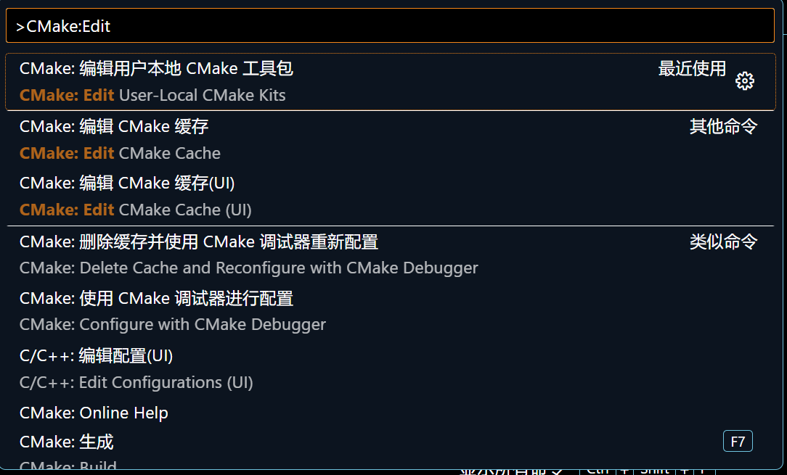
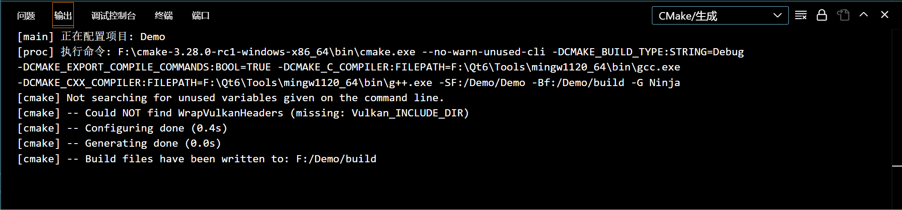

# Vscode + CMake 编译 Qt6 项目
___
## 环境配置
- Windows 11
- Qt Creater 6.6.1
  请将库`Qt6`添加至`环境变量-系统变量-Path`
  `F:\Qt6\6.6.1\mingw_64\bin`
  `F:\Qt6\6.6.1\mingw_64\lib`
  替换成你的 Qt6 绝对路径
- CMake 3.28.0
- MinGW-64bit
- Vscode CMake Extension
- Vscode CMake Tools Extension
请在`vscode-setting`中搜索`cmake`，设置你的 cmake 绝对路径

___
## 编译步骤
- 使用 Qt 创建 Widgets 项目，构建套件推荐选择`Desktop Ot 6.61 MinGW 64-bit`

- 使用 Vscode 打开项目文件夹，`ctrl+shift+p`搜索`CMake:Edit`

打开 `User-Local CMake Kits`，在该 json 文件添加如下内容
    ```json
    {
        "name": "qt6_mingw_64",
        "compilers": {
            "C": "F:\\Qt6\\Tools\\mingw1120_64\\bin\\gcc.exe",
            "CXX": "F:\\Qt6\\Tools\\mingw1120_64\\bin\\g++.exe"
        },
        "isTrusted": true,
        "environmentVariables": {
            "CMT_MINGW_PATH": "F:\\Qt6\\Tools\\mingw1120_64\\bin"
        }
    }
    ```
    路径请自行替换
- 选择工具包
  
  `ctrl+shift+p`输入指令`CMake: Select a Kit`
  如果找不到该指令，请输入`CMake: Quick Start`
  
  为该项目选择你刚刚添加的 Kit 包即可
- 配置与生成
  
  `ctrl+shift+p`输入`CMake: Configure`
  
  `ctrl+shift+p`输入`CMake: Build`
  
  如此已生成项目可执行文件，`ctrl+shift+p`输入`CMake: Debug`可调试

当然，你也可以用命令行指令完成上述编译操作。
