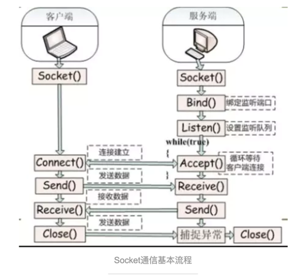

# 4月22日上机课

## 阶段三指南

> DDL：2024-05-20

- 请仔细阅读[阶段3任务](../../task/2.4-stage3.md)。
- 关于联机逻辑，可以参考[demo](https://github.com/JongMelon/QtNetworkDemo)。
- 在验收时，我们会要求小组内不同机器联机。
- 但在实际比赛时，你们会在组间联机，这很可能出现一些问题。
- 一类问题是联机逻辑问题，例如某一组向服务端发送了错误的消息，导致服务端崩溃。我们在`2.4-stage3 测试指南`中提供了一种自动化检查联机逻辑是否一致的方案，需要你们提交一个没有图形界面的最小化联机对战程序，具体提交方式待通知。
- 还有一类问题是网络问题，例如某一组连接到了别的什么局域网而不是`RUC-Web`，或者某一组忘了关代理。这类问题我们无法提前检查，显然助教的电脑无法复制你们比赛当天的网络环境。一种可能的解决方法是你们提前去找另外16个组测试联机，理论上如果操作规范，是不会出现问题的。
- 你会发现 “提前去找另外16个组测试联机” 的方法也可以排查联机逻辑问题，没错，如果你们愿意课下自行测试，也可以不提交最小化联机对战程序。在阶段三结束后的上机课上，我们鼓励相互测试。
- Start early, test often.

> 本阶段的任务重点是联机逻辑部分，其次才是完善游戏逻辑。

- 我们提供了二次封装的网络库，请仔细阅读[network api](../../network/doc/api.md)。

- 并遵循[网络协议](../../network/doc/protocol.md)。