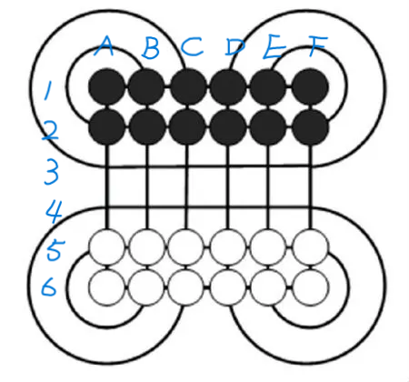

# Surakarta 棋

## 规则

- 通常 6 路棋盘，双方各拥有两排棋子落于自己的底线处。
- 黑子先手，双方轮流移动棋子，不能跳过自己的回合。
- 内棋线：棋盘中的所有直线。
- 外棋线：棋盘外的 8 条 270 度弧线。
- 移动棋子有两种方式：
  - 邻移：移动己方棋子朝上下左右对角线八个方向之一至空邻点，但不得经过外棋线。
  - 旋吃：沿内棋线作直线移动，必须经过外棋线转弯（或者说，经过大于等于一个外棋线），又移入沿内棋线作直线移动，不能弯折（出发方向确定后，你只能一直往前，或者遇到外棋线旋转270度后继续向前），中间不能有障碍，直到遇到敌棋方停止，并将后者移出棋盘。
- 结束方式：
  - 一方的棋子被吃完，对方获胜。
  - 双方长时间无法取得进展（僵局），协议结束，此时所剩棋子较多的一方获胜，相同则为平局。为了机器自动判断，我们规定当双方超过 max_no_capture_round (40) 个回合没有吃子时，游戏结束。
  - 一方走了非法步，对方获胜。
  - 一方单步思考时间超时（10s），对方获胜。
  - 一方认输，对方获胜。

> 注意我们没有没有规定困毙为输，困毙时应该用户方主动认输，而不交给服务器判断。这是为了降低实现难度。

我们规定默认的棋盘方向和坐标记法如下，注意靠近黑方的是 1，靠近白方的是 6，博弈双方采用的坐标轴是一样的（显示可以不同，例如黑方把自己摆在下方）。

### 拓展棋盘

我们规定扩展的 n 路棋盘为：

- n 必须是偶数
- 棋盘大小为 n*n
- 双方仍然各有两排棋子，即各有 2*n 个棋子
- 每个角有 n/2 - 1 条外棋线，例如 8 路棋盘每个角上就有 3 个圆弧，相比 6 路棋盘多了 1 条。

## 常见的棋类博弈算法

1. 贪心：设计一个启发式估值函数，选择最大的一步
2. 博弈树，minmax 搜索，alpha-beta 剪枝：https://blog.csdn.net/moonlight11111/article/details/124208342
3. 蒙特卡洛搜索树(MCTS)，UCT：https://blog.csdn.net/m0_46413065/article/details/115525027

> 本实验的最低要求是贪心，最高要求是 minmax 搜索或者 MCTS。写更复杂的算法不会获得加分。
