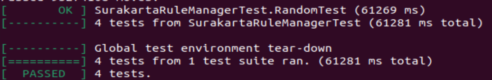

# 第一阶段报告

## 1. 游戏规则实现

> Written by 2023202302 ~~yermog~~ 方言诚
> 2024.3.14

### 1.1 JudgeMove 

#### 1.1.1 规则解读 （~~草率版~~）

该部分函数需要对输入的 **move** 进行合法性判断，并返回 **SurakartaIllegalMoveReason** 类值表示此次移动的类型

通过分析可知：

- 判断部分 **move** 的情况是易如反掌的，如：

    ```cpp
    enum class SurakartaIllegalMoveReason {
        OUT_OF_BOARD,              // from or to position is out of board
        NOT_PIECE,                 // move a position that is not a piece
        NOT_PLAYER_PIECE,          // move a piece that is not the player's
    };
    ```

    - **注意，在判断 OUT_OF_BOARD 时务必要把 move.from 的参数也包含进去，不然会造成 Segmentation Fault**
    - ~~**在这个Segmentation Fault上我浪费了数个小时...**~~

- 判断有关 **NON_CAPTURE_MOVE** 的 **move** 情况也不难

    只要判断 **move** 中的 **from** 和 **to** 是否相邻（八个方向）即可

- - -
- 最困难的是判断 **CAPTURE_MOVE** 的合法性

    一次合法的 **CAPTURE_MOVE** 应该具有以下的特征：

    - 移动的 **from** 位置上有一个 **game_info_->current_player_** 的棋子
      - 这个条件已被 **NOT_PIECE** 和 **NOT_PLAYER_PIECE** 所涵盖
  
    - 移动的 **to** 位置上有一个对方的的棋子
      - 如果是 **NONE** 棋子，则等同于 **NON_CAPTURE_MOVE** （~~**我在说什么废话啊**~~）
      - 如果是自己的棋子，显然是 **ILLIGAL** 的 （~~**别问为啥不是ILLEGAL**~~）
  
    - 吃子的过程必须经过一次旋移且必须走直线
      - 旋移至少为一次且可以进行多次 
      - 但是**显然显然显然**旋移最多进行四次，之后的路径是重复的
      - 有些棋子是永远永远也无法被吃掉的！  

- - - 
- 通过观察，我对 **CAPTURE_MOVE** 的吃子移动进行了拆解：

    - 棋子从 **from** 任意移动一般可以回到自己的原位
        - **特别注意！** 某些情况下的棋子无法到达旋转的轨道上（也就无法回到原位），最好的例子就是四个角上的棋子

    - 一个棋子吃子的**初始方向**只可能有四种：**上、下、左、右**
  
    - **上、下**起始方向移动时，棋子回到 **from** 位置的**相对顺序**是一致的
        - **相对顺序**的解释见下图：
        ```cpp
        /*
                    原始棋盘                   移动棋盘（字母用来标明位置）            
                   x 0 1 2 3 4 5                   x 0 1 2 3 4 5                
                y┏━━━━━━━┓ ┏━━━━━━━┓            y┏━━━━━━━┓ ┏━━━━━━━┓           
                 ┃ ┏━━━┓ ┃ ┃ ┏━━━┓ ┃             ┃ ┏━━━┓ ┃ ┃ ┏━━━┓ ┃           
                0┃ ┃ 0 0 A 0 0 0 ┃ ┃            0┃ ┃ 0 0 A g 0 0 ┃ ┃          
                1┃ ┗ 0 0 0 0 0 0 ┛ ┃            1┃ ┗ 0 0 r h 0 0 ┛ ┃           
                2┗━━ 0 0 0 0 0 0 ━━┛            2┗━━ a b c d e f ━━┛        
                3┏━━ 0 0 0 0 0 0 ━━┓            3┏━━ o n m i l k ━━┓          
                4┃ ┏ 0 0 0 B 0 0 ┓ ┃            4┃ ┏ 0 0 q B 0 0 ┓ ┃          
                5┃ ┃ 0 0 0 0 0 0 ┃ ┃            5┃ ┃ 0 0 p j 0 0 ┃ ┃           
                 ┃ ┗━━━┛ ┃ ┃ ┗━━━┛ ┃             ┃ ┗━━━┛ ┃ ┃ ┗━━━┛ ┃           
                 ┗━━━━━━━┛ ┗━━━━━━━┛             ┗━━━━━━━┛ ┗━━━━━━━┛            
        */
        ```
        - 假设我要用（2，1）的 **“A”** 来吃掉（3，4）的 **“B”** 再回到（2，1）的 **“A”**

        - 如果往上，棋子移动链是 
          - **A**-a-b-c-d-e-f-g-h-d-i-**B**-j-k-l-i-m-n-o-p-q-m-c-r-**A**

        - 如果往下，棋子移动链是 
          - **A**-r-c-m-q-p-o-n-m-i-l-k-j-**B**-i-d-h-g-f-e-d-c-b-a-**A**

        - 可以发现：这两条位置链的顺序是一样的，只是方向相反————但这并不会影响我们处理

        - 往左和往右的位置链也类似

- - -
- 总之：
    - **先以 from 位置为 position_state[0] 来构建移动数组记录移动链**

      - 该过程并没有想象的那么简单，你需要做的事情有：
        1. 记录下每一个位置的类型->有棋子、没有棋子、旋转轨道、终点位置
        2. 记录后移动位置到下一个点
        3. 当到达棋盘边缘时需要记录旋转轨道，并且找到下一个位置
        4. 重复1-3步骤，直到完成全部记录
  
    - **接着分析移动链来判断吃子是否是 LEGAL 的**

      - 分析一共进行两次：从[0]位置到 **move.to** 位置和从 **数组末端[4 * broad_size_ + 3]** 到 **move.to** 位置

      - 分析时要注意：是否经过旋转轨道，是否有障碍棋子阻拦，终点位置是否在数组内……
  
    - **注意**：
  
      - 移动链的长度是固定的，应为 **4 * broad_size_ + 4** ,多的4格长度用来记录旋转轨道
  
      - **（~~还是那句话~~）** 有些位置无法构建位置链————因为不是所有的行列在往特定方向移动时都有旋转轨道!

      - **from** 位置的棋子应该被认为是 **NONE** 的 ！
  
      - **（旋吃的过程需要棋子亲历亲为，而不是使用替身使者！！）**

    > 这个BUG是我最先发现的，如果大伙因为这个BUG造成了**工期延长**等问题，我在这里磕头赔不是了QaQ **咚咚咚**

- - -
#### 1.1.2 代码实现

  - 首先，我们需要一个数组来存储移动链状态
    ```cpp
    enum class Circle_state {
        Empty, // 无棋子
        Piece, // 有棋子
        Corner, // 旋转轨道
        End // 终点（move.to）
    };
    ```

  - 接着通过各种函数来获取移动链并对移动链进行分析 **（函数内部实现即是上述分析，代码此处略）**
    ```cpp
    Circle_state Capture_circle_line[(int)board_size_*4+5]; // 构造左右移动链
    Circle_state Capture_circle_list[(int)board_size_*4+5]; // 构造上下移动链
    Get_Capture_Circle_line(Capture_circle_line, board_, board_size_, move.from, move.to); //获取左右移动链
    Get_Capture_Circle_list(Capture_circle_list, board_, board_size_, move.from, move.to); //获取上下移动链
    if(Is_Capture_False(Capture_circle_line, Capture_circle_list, board_size_) == false) // 进行判断
        return SurakartaIllegalMoveReason::ILLIGAL_CAPTURE_MOVE;
    else
        return SurakartaIllegalMoveReason::LEGAL_CAPTURE_MOVE;
    ```
  - 最后和其他的状态综合一下
    - **注意：判断旋转吃子应该放在整个判断较后面的位置，先把一些简单的判断完有助于减少后续工作量**

  - **在分析过程中不出现broad_size_==6的代换而是直接运用broad_size进行计算可以使该函数满足其他broad_size_的条件**

  - **本组代码broad_size_ = 8也可通过测试**

  
  
- - -
### 1.2 JudgeEnd

#### 1.2.1 终局规则解读

> ~~**这么简单的东西还需要解读吗**~~

该部分函数需要对输入的 **reason** 进行合法性判断，并返回 **SurakartaIllegalEndReason** 类值表示是否结束及其原因

- 不用分析些啥，反正就这么几类情况，写的时候注意是**BLACK**获胜还是**WHITE**获胜就行了

#### 1.2.2 代码实现

  - **直接上代码！**
    ```cpp
    SurakartaPlayer current_player = game_info_->current_player_;
    if(reason == SurakartaIllegalMoveReason::ILLIGAL_CAPTURE_MOVE || reason == SurakartaIllegalMoveReason::ILLIGAL_NON_CAPTURE_MOVE || reason == SurakartaIllegalMoveReason::OUT_OF_BOARD || reason == SurakartaIllegalMoveReason::NOT_PIECE || reason == SurakartaIllegalMoveReason::NOT_PLAYER_PIECE) {
        if(current_player == SurakartaPlayer::WHITE)
            return std::make_pair(SurakartaEndReason::ILLIGAL_MOVE, SurakartaPlayer::BLACK);
        else
            return std::make_pair(SurakartaEndReason::ILLIGAL_MOVE, SurakartaPlayer::WHITE);
    } // 判断是否是非法移动进而导致游戏结束
    else if(reason == SurakartaIllegalMoveReason::LEGAL_NON_CAPTURE_MOVE) {
        if((int)game_info_->num_round_ - (int)game_info_->last_captured_round_ == (int)game_info_->max_no_capture_round_) {
            int black_piece_num = 0;
            int white_piece_num = 0;
            for (int i = 0; i < (int)board_size_; i++)
                for (int j = 0; j < (int)board_size_; j++) {
                    if ((*board_)[i][j]->GetColor() == PieceColor::BLACK)
                        black_piece_num++;
                    else if ((*board_)[i][j]->GetColor() == PieceColor::WHITE)
                        white_piece_num++;
                }
            if (black_piece_num>white_piece_num)
                return std::make_pair(SurakartaEndReason::STALEMATE, SurakartaPlayer::BLACK);
            else if (black_piece_num<white_piece_num)
                return std::make_pair(SurakartaEndReason::STALEMATE, SurakartaPlayer::WHITE);
            else 
                return std::make_pair(SurakartaEndReason::STALEMATE, SurakartaPlayer::NONE);
        }
    } // 判断是否是“长将”进而导致游戏结束
    return std::make_pair(SurakartaEndReason::NONE, SurakartaPlayer::NONE);
    ```


- - -
## 2. AI设计

> Written by 2023202302 ~~yermog~~ 方言诚
> 2024.3.24

### 2.0 Ai与Random对战函数

```cpp
#include <chrono>
#include <iostream>
#include <thread>
#include "surakarta/surakarta_agent/surakarta_agent_mine.h"
#include "surakarta/surakarta_agent/surakarta_agent_random.h"
#include "surakarta/surakarta_common.h"
#include "surakarta/surakarta_game.h"

#define ANSI_CLEAR_SCREEN "\033[2J"
#define ANSI_MOVE_TO_START "\033[H"
#define SLEEP_TIME_MS 0
#define TEST_ROUND 1000

class SurakartaGame_play {
   public:
    struct Game_play_result {
        PieceColor Mine;
        SurakartaPlayer winner_;
    };

    SurakartaGame game;

    const Game_play_result PlayGame() {
        PieceColor Mine;
        game.StartGame();
        std::shared_ptr<SurakartaAgentMine> agent1 = std::make_shared<SurakartaAgentMine>(game.GetBoard(), game.GetGameInfo(), game.GetRuleManager());
        std::shared_ptr<SurakartaAgentRandom> agent2 = std::make_shared<SurakartaAgentRandom>(game.GetBoard(), game.GetGameInfo(), game.GetRuleManager());
        bool is_agent1_turn = rand() % 2 == 0;  // 随机模拟先后手
        if (is_agent1_turn)
            Mine = PieceColor::BLACK;
        else
            Mine = PieceColor::WHITE;
        while (!game.IsEnd()) {
            if (is_agent1_turn) {
                auto move = agent1->CalculateMove();
                game.Move(move);
                is_agent1_turn = !is_agent1_turn;
            } else {
                auto move = agent2->CalculateMove();
                game.Move(move);
                is_agent1_turn = !is_agent1_turn;
            }
            std::this_thread::sleep_for(std::chrono::milliseconds(SLEEP_TIME_MS));
        } //循环形成来回下棋
        return Game_play_result{Mine, game.GetGameInfo()->winner_};
    }
};

int main() {
    std::cout << ANSI_CLEAR_SCREEN << ANSI_MOVE_TO_START;
    double Mine_win = 0;
    double Random_win = 0;
    double Stalemate = 0;
    for (int i = 0; i < TEST_ROUND; i++) { // 统计胜率
        SurakartaGame_play game;
        SurakartaGame_play::Game_play_result result = game.PlayGame();
        if (result.winner_ == result.Mine) {
            Mine_win++;
        } else if (result.winner_ == ReverseColor(result.Mine)) {
            Random_win++;
        } else
            Stalemate++;
        printf("Win rate:");
        printf("%.2lf%% ", Mine_win / (Mine_win + Random_win + Stalemate) * 100);
        std::cout << "  Random_win: " << Random_win << "  Mine_win: " << Mine_win << "  Stalemate:" << Stalemate << std::endl;
    }
    return 0;
}
```

- - -
### 2.1 基本思路

- 首先，我们需要搞明白这个想要在这个游戏里的一些基本事实：

  1. 攻击是相对的，当你的棋子可以攻击对方的棋子时，对方的棋子也可以攻击你的棋子
    - 也就是说，先下手总是比后下手要好
  
  2. 棋子是无差别的，每一种颜色的棋子所具有的价值相等（该性质和象棋不同和围棋类似）
    - 也就是说，**攻击力** 和 **棋子颜色** 无关
  
  3. 棋子的位置可能会导致棋子的**暂时价值**不一般
    - 比如说：角落上的棋子没有**进攻能力**，但是它可以保证自己不被吃掉

- 于是我们可以得出一个基本的获胜思路：尽可能的在有限回合内吃掉对方更多的棋子，且保证自己的棋子不被吃掉
  
- - -

### 2.2 Ai版本

#### Ai 1.0 

> Written by 2023202302 ~~yermog~~ 方言诚
> 2024.3.24

- 基本思路：
  
  1. 使用贪心算法
   
  2. 在每一步的计算中，通过循环遍历全部的位置，找到存在**吃和被吃**关系的棋子
   
  3. 对于任意己方棋子，如果存在的**吃和被吃**关系越多，那么我们可以（**~~草率的~~**）认为走这个棋子的吃子收益最大
    - 这个思路显然是不完善的
    - 但是对于任意己方棋子，我们都可以通过**吃和被吃**关系来判断其**暂时价值**，且关系成立越多其价值在某一程度上就会越大
    - 比如说某棋子有五个这种关系，那么如果你不走这个棋子，在下一步对方吃掉你的该棋子就有五种可能的方法
    - 显然我们不想让对方吃子的选择更加多
    - 于是我们可以认为：**吃和被吃**关系越多，那么这个棋子的价值就越大
  
- 综上：代码核心为：
  - 遍历全部位置，找到存在**吃和被吃**关系的棋子
  - 判断任意己方棋子**吃和被吃**关系越多，那么这个棋子的价值就越大，也就是对棋子评分
  - 走评分最高的棋子

> 经过大量测试，该Ai的胜率约为**65%**


- - -
> 后续算法更新，敬请期待！

- - -

## 3. Q&A Part

> 这个部分完成的好吗？
  - 我们在限定时间内完成了所有任务，并且通过了所有测试用例。
  - 在make部分我们的代码不存在任何的Warning
  
  - 代码内容充分使用了C++面向对象的知识（eg.见2.0 Ai与Random对战函数）
  - 代码内容里有充足的注释供大家理解
  
> 为什么只有你一个人写这个代码？
  - 另外两个同学在学后面的内容
  - 后面的report会看见他们的身影 ~~但愿~~

> 这个代码可参考吗
  - 当然可以！
  - 尤其是如果你不会写Ai与Random对战函数，你可以借用或者学习我们的代码xD

